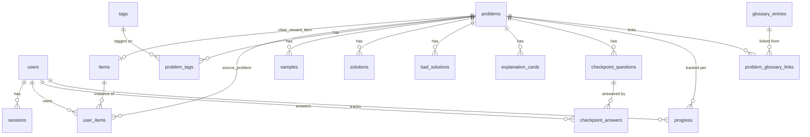

# Code Sensei DB設計書(Cloudflare D1 / SQLite)

`SPEC.md`の5節(データモデル)を正式なテーブル定義に落とし込んだもの。D1はSQLiteベースなので、型はSQLiteの型(`TEXT`/`INTEGER`/`REAL`)に従う。`BOOLEAN`は`INTEGER`(0/1)、`ENUM`は`TEXT`+`CHECK`制約、`JSON`は`TEXT`にシリアライズして保存する。IDはすべて`TEXT`(nanoid等のランダム文字列)を想定。日時は`TEXT`(ISO8601文字列)。

## ER図



`code_reading_entries`は他テーブルと関連を持たない独立テーブルのため図から省略。

## テーブル定義

### users

| カラム | 型 | 制約 | 備考 |
|---|---|---|---|
| id | TEXT | PK | |
| username | TEXT | NOT NULL, UNIQUE | メールアドレスは持たない |
| password_hash | TEXT | NOT NULL | bcryptjs or WebCrypto PBKDF2 |
| display_name | TEXT | NOT NULL | |
| role | TEXT | NOT NULL, CHECK(role IN ('student','admin')), DEFAULT 'student' | |
| avatar_config | TEXT | NOT NULL, DEFAULT '{}' | JSON文字列(肌色/髪型/服) |
| xp | INTEGER | NOT NULL, DEFAULT 0 | |
| level | INTEGER | NOT NULL, DEFAULT 1 | xpから算出し同期(`level = floor(xp/100)+1`等) |
| coins | INTEGER | NOT NULL, DEFAULT 0 | |
| created_at | TEXT | NOT NULL | |
| updated_at | TEXT | NOT NULL | |

### sessions

| カラム | 型 | 制約 | 備考 |
|---|---|---|---|
| id | TEXT | PK | セッショントークン(ランダム文字列) |
| user_id | TEXT | NOT NULL, FK→users(id) ON DELETE CASCADE | |
| expires_at | TEXT | NOT NULL | |
| created_at | TEXT | NOT NULL | |

INDEX: `sessions(user_id)`

**有効期限ポリシー**: 発行時に`expires_at`を**30〜90日後**に設定する長期セッション。明示的なログアウトのみで失効させ、子供が使う端末で毎回ログインし直す手間を避ける。

### items

| カラム | 型 | 制約 | 備考 |
|---|---|---|---|
| id | TEXT | PK | |
| name | TEXT | NOT NULL | |
| description | TEXT | NULL | |
| icon_key | TEXT | NOT NULL | フロント側スプライトキー |
| slot | TEXT | CHECK(slot IN ('hat','cape','shield','other')), NULL | NULLならコレクション専用(装備不可) |
| price_coins | INTEGER | NULL | NULLなら非売品(クリア報酬専用) |
| is_key | INTEGER | NOT NULL, DEFAULT 0 | 将来のボーナス部屋解錠用(初期実装では未使用) |
| created_at | TEXT | NOT NULL | |
| updated_at | TEXT | NOT NULL | |

### user_items

| カラム | 型 | 制約 | 備考 |
|---|---|---|---|
| id | TEXT | PK | |
| user_id | TEXT | NOT NULL, FK→users(id) ON DELETE CASCADE | |
| item_id | TEXT | NOT NULL, FK→items(id) | |
| source | TEXT | NOT NULL, CHECK(source IN ('clear_reward','store_purchase')) | |
| source_problem_id | TEXT | NULL, FK→problems(id) | クリア報酬の場合のみ |
| is_equipped | INTEGER | NOT NULL, DEFAULT 0 | |
| acquired_at | TEXT | NOT NULL | |

UNIQUE: `(user_id, item_id)` / INDEX: `user_items(user_id)`, `user_items(item_id)`

**アプリ層の不変条件(スキーマ制約では表現しない)**: 同じ`slot`(例: 帽子)を同時に複数装備できないようにする。装備APIは「新しいアイテムを装備する際、同じ`items.slot`を持つ他の所持アイテムの`is_equipped`を自動的に`false`にする」処理を行う。

### tags

| カラム | 型 | 制約 |
|---|---|---|
| id | TEXT | PK |
| name | TEXT | NOT NULL, UNIQUE |

### problems

| カラム | 型 | 制約 | 備考 |
|---|---|---|---|
| id | TEXT | PK | スラッグ(例: `typical90_a`)を維持 |
| contest | TEXT | NOT NULL | |
| problem_number | TEXT | NOT NULL | |
| title | TEXT | NOT NULL | |
| atcoder_url | TEXT | NOT NULL | |
| difficulty | INTEGER | NOT NULL | AtCoderの★スケール(1〜) |
| required_level | INTEGER | NOT NULL, DEFAULT 1 | この★帯に入るための最低プレイヤーレベル。**`difficulty`から自動算出**(例: `required_level = (difficulty-1)×2+1`)し、管理画面では★のみ入力させる。バランス調整は算出式の修正で全問題に一括反映できる。 |
| statement_md | TEXT | NOT NULL | |
| constraints_md | TEXT | NOT NULL | |
| constraints_note_md | TEXT | NULL | |
| statement_note_md | TEXT | NULL | かんたん解説(S1) |
| map_x | INTEGER | NULL | |
| map_y | INTEGER | NULL | |
| map_order | INTEGER | NULL | 同★帯内の表示順(必須ではない、UI補助用) |
| clear_reward_item_id | TEXT | NULL, FK→items(id) | |
| is_published | INTEGER | NOT NULL, DEFAULT 0 | |
| added_at | TEXT | NOT NULL | |
| created_at | TEXT | NOT NULL | |
| updated_at | TEXT | NOT NULL | |

INDEX: `problems(difficulty)`, `problems(is_published)`

**削除ポリシー**: 管理画面からの通常の「削除」操作は`is_published=false`への更新(論理削除)とする。物理削除(`DELETE`)は`progress`/`checkpoint_answers`/`user_items.source_problem_id`をCASCADEで失うため、確認ダイアログ付きの別操作として扱い、誤操作を防ぐ。

### problem_tags

| カラム | 型 | 制約 |
|---|---|---|
| problem_id | TEXT | NOT NULL, FK→problems(id) ON DELETE CASCADE |
| tag_id | TEXT | NOT NULL, FK→tags(id) ON DELETE CASCADE |

PK: `(problem_id, tag_id)` / INDEX: `problem_tags(tag_id)`

### samples

| カラム | 型 | 制約 | 備考 |
|---|---|---|---|
| id | TEXT | PK | |
| problem_id | TEXT | NOT NULL, FK→problems(id) ON DELETE CASCADE | |
| position | INTEGER | NOT NULL | 表示順 |
| input | TEXT | NOT NULL | |
| output | TEXT | NOT NULL | |
| explanation_md | TEXT | NULL | |

INDEX: `samples(problem_id, position)`

### solutions

| カラム | 型 | 制約 | 備考 |
|---|---|---|---|
| id | TEXT | PK | |
| problem_id | TEXT | NOT NULL, FK→problems(id) ON DELETE CASCADE | |
| language | TEXT | NOT NULL, CHECK(language IN ('python','cpp','typescript','ruby','php','rust','perl')) | |
| code | TEXT | NOT NULL | |
| steps_json | TEXT | NULL | 現状未使用 |

UNIQUE: `(problem_id, language)`

### bad_solutions

| カラム | 型 | 制約 | 備考 |
|---|---|---|---|
| id | TEXT | PK | |
| problem_id | TEXT | NOT NULL, FK→problems(id) ON DELETE CASCADE | |
| language | TEXT | NOT NULL, CHECK(language IN (...)) | solutionsと同じ言語セット |
| label | TEXT | NOT NULL | 例: "O(L×N) 線形探索" |
| code | TEXT | NOT NULL | |

UNIQUE: `(problem_id, language)`

### explanation_cards

| カラム | 型 | 制約 | 備考 |
|---|---|---|---|
| id | TEXT | PK | |
| problem_id | TEXT | NOT NULL, FK→problems(id) ON DELETE CASCADE | |
| screen | TEXT | NOT NULL, CHECK(screen IN ('s2','s4','s6')) | |
| position | INTEGER | NOT NULL | カルーセル内の順序 |
| title | TEXT | NULL | |
| body_md | TEXT | NOT NULL | |
| variant | TEXT | NULL | 例: 'bad'\|'good'(S2の対比カード等に使用) |

INDEX: `explanation_cards(problem_id, screen, position)`

### checkpoint_questions

| カラム | 型 | 制約 | 備考 |
|---|---|---|---|
| id | TEXT | PK | |
| problem_id | TEXT | NOT NULL, FK→problems(id) ON DELETE CASCADE | |
| screen | TEXT | NOT NULL, CHECK(screen IN ('s2','s4','s6')) | 対応する小ボス |
| position | INTEGER | NOT NULL | |
| question_md | TEXT | NOT NULL | |
| choices_json | TEXT | NOT NULL | JSON配列(選択肢文字列) |
| correct_choice_index | INTEGER | NOT NULL | 正誤判定はサーバー側でこれと照合 |
| explanation_md | TEXT | NULL | 誤答時に出すヒント/解説 |

INDEX: `checkpoint_questions(problem_id, screen)`

### checkpoint_answers

| カラム | 型 | 制約 | 備考 |
|---|---|---|---|
| id | TEXT | PK | |
| user_id | TEXT | NOT NULL, FK→users(id) ON DELETE CASCADE | |
| checkpoint_question_id | TEXT | NOT NULL, FK→checkpoint_questions(id) ON DELETE CASCADE | |
| is_correct | INTEGER | NOT NULL | サーバー側で選択肢indexを照合して記録 |
| attempt_count | INTEGER | NOT NULL, DEFAULT 1 | 再挑戦のたびにインクリメント(UPSERT) |
| answered_at | TEXT | NOT NULL | 最新の解答日時 |

UNIQUE: `(user_id, checkpoint_question_id)` — 最新の解答結果を1行で保持(UPSERT)。履歴が必要になれば別途ログテーブルを検討。

INDEX: `checkpoint_answers(user_id)`

### glossary_entries

| カラム | 型 | 制約 |
|---|---|---|
| id | TEXT | PK |
| name | TEXT | NOT NULL |
| short | TEXT | NULL |
| description_md | TEXT | NOT NULL |
| without_label | TEXT | NULL |
| without_code | TEXT | NULL |
| with_label | TEXT | NULL |
| with_code | TEXT | NULL |
| when_to_use_md | TEXT | NULL |

### problem_glossary_links

| カラム | 型 | 制約 |
|---|---|---|
| problem_id | TEXT | NOT NULL, FK→problems(id) ON DELETE CASCADE |
| glossary_id | TEXT | NOT NULL, FK→glossary_entries(id) ON DELETE CASCADE |

PK: `(problem_id, glossary_id)` / INDEX: `problem_glossary_links(glossary_id)`

### code_reading_entries

| カラム | 型 | 制約 |
|---|---|---|
| id | TEXT | PK |
| name | TEXT | NOT NULL |
| short | TEXT | NULL |
| body_md | TEXT | NOT NULL |
| python_code | TEXT | NULL |
| other_note | TEXT | NULL |

### progress

| カラム | 型 | 制約 | 備考 |
|---|---|---|---|
| id | TEXT | PK | |
| user_id | TEXT | NOT NULL, FK→users(id) ON DELETE CASCADE | |
| problem_id | TEXT | NOT NULL, FK→problems(id) ON DELETE CASCADE | |
| screen | TEXT | NOT NULL, CHECK(screen IN ('s1','s2','s3','s4','s5','s6','s7')) | |
| status | TEXT | NOT NULL, CHECK(status IN ('not_started','in_progress','completed')), DEFAULT 'not_started' | |
| completed_at | TEXT | NULL | |
| updated_at | TEXT | NOT NULL | |

UNIQUE: `(user_id, problem_id, screen)` / INDEX: `progress(user_id, problem_id)`

## 保存 vs 都度算出の方針(再掲・詳細化)

| 対象 | 扱い | 根拠 |
|---|---|---|
| マップのロック/解除/クリア状態 | **都度算出**(`GET /api/map`内) | `user.level` × `problem.required_level`の比較+`progress`から導出。保存すると`required_level`変更時に不整合が起きる。 |
| 「問題クリア」判定 | **都度算出** | `checkpoint_answers`(小ボス3体分)+`progress`のS7行から導出。管理画面でチェック問題数を増減できるため固定フラグにしない。 |
| `users.xp` / `level` / `coins` | **保存(ミュータブルなカウンタ)** | 単純な加算処理で、イベント発生時にAPIが加算。都度算出パターンの唯一の例外(ゲート判定に使うのは`level`のみ)。 |
| `checkpoint_answers.is_correct` | **保存(最新解答を1行でUPSERT)** | 再ログイン時に「どの小ボスを倒し済みか」を復元するために必要。 |

## Drizzle実装イメージ(参考・抜粋)

実装フェーズで`apps/api/src/db/schema.ts`に書き起こす際の形。設計確認用の抜粋で、全テーブル分ではない。

```typescript
import { sqliteTable, text, integer, primaryKey, unique } from "drizzle-orm/sqlite-core";

export const users = sqliteTable("users", {
  id: text("id").primaryKey(),
  username: text("username").notNull().unique(),
  passwordHash: text("password_hash").notNull(),
  displayName: text("display_name").notNull(),
  role: text("role", { enum: ["student", "admin"] }).notNull().default("student"),
  avatarConfig: text("avatar_config").notNull().default("{}"),
  xp: integer("xp").notNull().default(0),
  level: integer("level").notNull().default(1),
  coins: integer("coins").notNull().default(0),
  createdAt: text("created_at").notNull(),
  updatedAt: text("updated_at").notNull(),
});

export const progress = sqliteTable("progress", {
  id: text("id").primaryKey(),
  userId: text("user_id").notNull().references(() => users.id, { onDelete: "cascade" }),
  problemId: text("problem_id").notNull().references(() => problems.id, { onDelete: "cascade" }),
  screen: text("screen", { enum: ["s1", "s2", "s3", "s4", "s5", "s6", "s7"] }).notNull(),
  status: text("status", { enum: ["not_started", "in_progress", "completed"] })
    .notNull()
    .default("not_started"),
  completedAt: text("completed_at"),
  updatedAt: text("updated_at").notNull(),
}, (t) => ({
  unq: unique().on(t.userId, t.problemId, t.screen),
}));
```

## マイグレーション運用

- `drizzle-kit generate`でマイグレーションファイルを生成し、Git管理する。
- ローカル: `wrangler d1 migrations apply <DB> --local`
- 本番: `wrangler d1 migrations apply <DB> --remote`(Actions内で実行)
- 初期データは`scripts/seed/seed.ts`が`data/*.json`を読み、INSERT文のSQLファイルを生成 → `wrangler d1 execute --file`で投入(マイグレーションとは別工程)。
